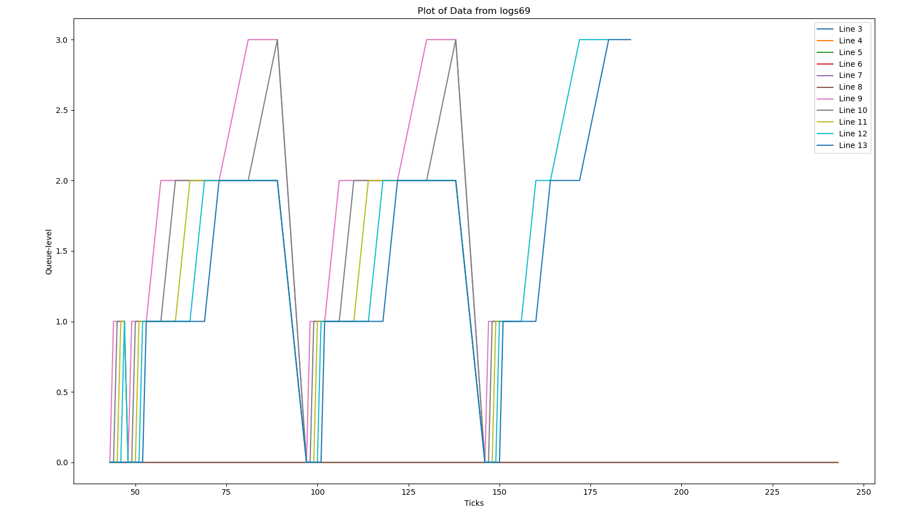

# `syscount`

## Overview

The system call `syscount` is added to track and record system calls made by a process during its execution. It provides how many times the the particular syscall was called while executing the mentioned command
- format `syscount mask command[]` example `syscount 65536 echo hello`

The `syscount` user command 

## Implementation Details

### 1. Kernel Changes

- **New array`uint syscall_count[32]` added to `struct proc`** in `kernel/proc.h`. It is initialized to `0` in `allocproc()` in `kernel/proc.c`.
- **Also changes made in `exit function in proc.c`**
```c
for (int i = 0; i < 32; i++)
  {
    par->syscall_count[i] += p->syscall_count[i];
  }

```
### 2. User Space Changes

- **User function `syscount` added in the `user` directory**.
- **Entry added for `syscount` in `user/usys.pl`:**

```bash
entry("syscount")
```
- **Added a new code `syscount.c` in `user`**

### 3. Kernel System Call Changes

- **Modifications in `kernel/syscall.c` and `kernel/syscall.h`** to support the new system call.
- **Function `sys_trace()` implemented in `kernel/sysproc.c`** to set the `trace_mask` value provided by the user.
- **in `kernal/syscall.c` we are incrementing the syscount**

#### `sysproc.c`:
```c
uint64
sys_getSysCount(void)
{

  int mask;
  argint(0, &mask);

  struct proc *p = myproc();
  int syscall_num = 0;
  uint64 count = 0;

  while ((mask & 1) == 0 && syscall_num < 32)
  {
    mask >>= 1;
    syscall_num++;
  }

  count = p->syscall_count[syscall_num];

  return count;
}
```

## How it Works
- here we first convert the mask to check for which syscall we want to find the syscount of and then the syscount is the total of syscount incremented in syscall.c and proc.c/exit function(adding the syscount of child process the parent process made)


# `sigalarm` and `sigreturn`

## Overview

This feature periodically alerts a process based on the CPU time it consumes. It is useful for compute-bound processes that need to limit CPU usage or take periodic actions. The new `sigalarm(interval, handler)` system call allows an application to be notified after consuming a specified amount of CPU time. Additionally, `sigreturn()` resets the process state to its state before the signal handler was called, allowing the process to resume where it left off.

### Functionality
- `sigalarm(interval, handler)`: After every `n` ticks of CPU time, the kernel calls the user-defined `handler` function. Once the handler returns, the process resumes its normal execution.
- `sigreturn()`: Restores the process state to what it was before the handler was executed, ensuring that the process resumes properly.

## Implementation Details

### 1. New Variables in `struct proc`

New variables are added to the `struct proc` in `kernel/proc.h` to support `sigalarm` and `sigreturn`.

```c
int interval;               
int till_tick;              
int bool_sigalarm;         
uint64 handler;            
struct trapframe *new_trapframe;  
```

### 2. `sys_sigalarm()` and `sys_sigreturn()` Functions

Implemented in `kernel/sysproc.c`:

### 3. Modifications in `usertrap()` in `kernel/trap.c`

Values of `interval` and `till_tick` are updated in the `usertrap()` function. When the number of ticks consumed by the process reaches the specified `interval`, the `bool_sigalarm` flag is set, and the handler is invoked. Once the handler completes, `sigreturn()` resets the flag to allow proper process execution.

### Entry added for `sigalarm and sigreturn ` in `user/usys.pl`:

# Lottery Based Scheduling

## Overview
In this first we assign tickets=1 first to each process and then the tickets will be assigned randomly to each process and 
then to select which process to schedule first we first sum the number of tickets each process have and then pick a 
ticket <= cummulative sum and then we run the process from the range which the randomly selected ticket belonged to 
i,e lets say we have p1=2 tickets , p2=14 tickets , p3=20 tickets . cummulative sum=36 . lets say randomly selected ticket is 17.
 now p3  will be scheduled first as randomly selected ticket belongs to 16-35. 
RANGES
p1=0-1
p2=2-15
p3=16-35

and also in my implementation the process which has more tickets has more chances of getting executed and also in my implemtion , 
lets say 2 processes have same number of tickets then the process which arrived first will be executed first even when the process 
which arrived late is selected through random selection 

### changes made in
- proc.h
- proc.c
    - allocproc(initialization part done here)
    - fork function (to make sure that the child has same number of tickets as that of parent as it was told to implement)
    - scheduler function (where the above implementation is done)
    - in procinit function too few changes are done
- sysproc.c (where the settickets function is implemented) 
- in syscall.c and user.h (few small changes were made)
- Entry added for `settickets` in `user/usys.pl`

### Note 
- initially all processes are given 1 ticket and when we do schedulertest , tickets are set randomly
- the child will have the same number of tickets as that of parent
- to run this `make clean ; make qemu SCHEDULER=LBS`

# MLFQ Scheduling

## Overview
In this the new process are added to queue 0 and eventually as they use their time slice in the particular queue they move down in the queue 
after every 48 ticks there will be priority boost and all the processes will be back in queue number 0
Also in queue's 0-3 which ever process is first found will be executed for example lets say we have 2 process in queue 0 and 3 process in queue 2
we first iterate the queues 0-2 and then when the process is found we execute it , like here the process in queue 0 will be running first 
i.e we will first execute all the process in queue0 then all the process in queue 1 and so on until we reach the final queue 3 where the processes will run 
in round robin form and inbetween the priority boost will also be happening every 48 ticks , at that time all the processes will be back in queue 0

queue 0 = 1 ticks
queue 1 = 4 ticks
queue 2 = 8 ticks
queue 3 = 16 ticks

### changes made in
- proc.h
- proc.c
    - allocproc(initialization part done here)
    - updatetime function (where queuelevel is changed and timeslice in decreased)
    - scheduler function (where the above implementation is done)
- in trap.c (taken care of timerinterupt by  user and kernel in case of MLFQ)

### Note 
- to run this `make clean ; make qemu SCHEDULER=MLFQ CPUS=1`


# Comparison Between Different Schedulers for CPUS=1


| Metric   | Default | LBS  | MLFQ |
|----------|---------|------|------|
| `rtime`  | 12      | 13   | 12   |
| `wtime`  | 150     | 161  | 139  |


# Implication of adding arrival time LBS policy

- we need arrival time in case when multiple processes have same tickets and we have to implement it in such a way that the process which arrived first is executed first even when any of these process from the multiple processes with same tickets are selected 
- for above implementation we need arrival time
# pitfalls in LBS policy
1. Starvation Risk:

If a process has very few tickets compared to others, its chances of winning the lottery are significantly lower. This could result in that process being starved of CPU time. While a process with only one ticket technically has a chance to win, it might rarely get CPU cycles, leading to prolonged waiting.

2. Ticket Allocation and Fairness:

The idea behind lottery scheduling is that processes with more tickets get a higher proportion of CPU cycles. However, deciding how to allocate tickets fairly and avoid monopolization by a few high-ticket processes can be tricky. In your case, if a process sets a very high number of tickets, it might hog CPU time, reducing the fairness of the system.

3. Overhead from Frequent Lottery Drawing:

Drawing the lottery at every time slice (tick) incurs computational overhead. Each time the scheduler must randomly select a winner based on the number of tickets, and this process might become inefficient with a large number of processes. Implementing this with a time slice of 1 tick will cause the scheduler to frequently re-evaluate which process to run, leading to overhead in managing the lottery.

# Processes having same tickets:

if all the processes have same number of tickets then it will be like FCFS policy as we are checking early arrival time in case of processes having same ticets

- lets say we have at t=0 p1 with 2 tickets 
- p2 arrive next at t=1 with 2 tickets 
- p3 arrive next at t=2 with 2 tickets 
- here even though p2 or p3 turns out to be winner we will be executing first p1 then p2 and then p3 as we are seeing early  arrival time 
 and this is same as FCFS scheduling policy 


# MLFQ Analysis



  


